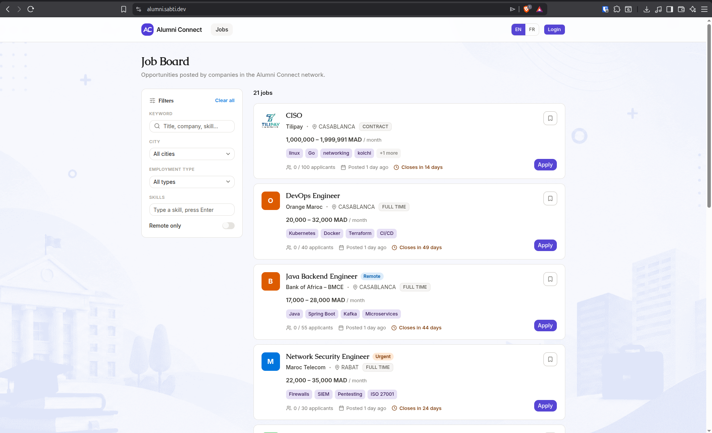
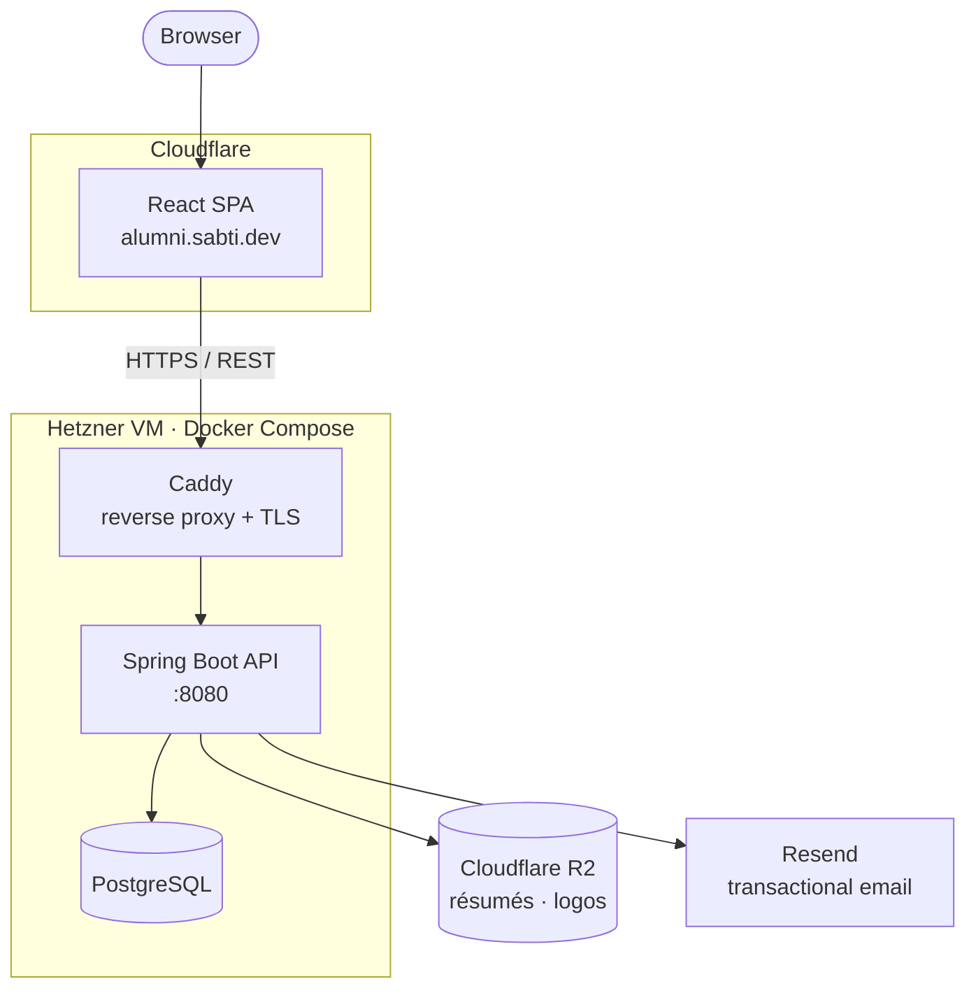
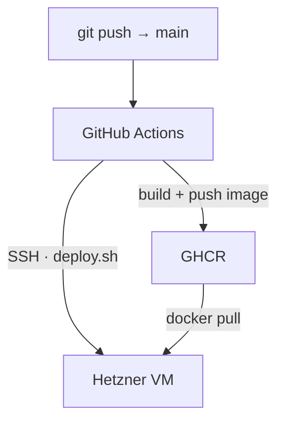

# Alumni Connect

**A moderated, bilingual job platform that connects a university's alumni with companies that want to hire them.**

[](https://github.com/RiadSab/alumni-connect/actions/workflows/deploy-backend.yml) 

**Live:** [alumni.sabti.dev](https://alumni.sabti.dev)



---

## The Problem

Our school doesn't have a dedicated channel to maintain relationships with its hiring partners, and no automated application flow between the two. Everything runs on manual coordination — which drains time for the school, the companies, and the students alike.

## The Solution

A single marketplace, organized around three roles and kept trustworthy by moderation:

- **Candidates** build a profile, upload a résumé, browse and apply to roles, save jobs, and track every application from a personal dashboard.
- **Companies** publish openings and manage applicants through a full review workflow — accept / reject / rate / prioritize / note — with owner- and recruiter-scoped team roles.
- **Admins** vet companies and members before they go live, keeping the marketplace credible.

---

## Architecture



**Continuous deployment** — every push to `main` is built and shipped automatically (details in [`docs/ci-cd.md`](docs/ci-cd.md)):



| Layer | Stack |
|---|---|
| **Frontend** | React 19, TypeScript, Vite, Tailwind CSS v4, shadcn / Radix UI, TanStack Query, React Router, Zod — deployed to Cloudflare Pages |
| **Backend** | Spring Boot 3 (Java 21), Spring Security, Spring Data JPA, Flyway — on a Hetzner VM via Docker Compose behind Caddy |
| **Data & services** | PostgreSQL, Cloudflare R2 (private file storage), Resend (email) |
| **CI/CD** | GitHub Actions → GHCR → SSH deploy over a hardened, command-locked key |

---

## Monorepo Structure

```
alumni-connect/
├── client/                 # React + Vite single-page app → Cloudflare Pages
│   └── src/
│       ├── api/            # HTTP client + endpoint wrappers
│       ├── features/       # domain hooks (auth, savedJobs, …)
│       ├── pages/          # route-level screens
│       ├── components/     # shared UI (shadcn / Radix)
│       ├── routes/         # route guards & config
│       └── lib/            # utilities, i18n
│
├── server/                 # Spring Boot REST API → Hetzner
│   └── src/main/java/dev/sabti/alumni_connect/
        ├── auth/           # login, JWT, refresh tokens, password reset
        ├── candidate/      # profiles, résumés, applications
        ├── company/        # company profiles, teams, job offers
        ├── job/            # job board, search, saved jobs
        ├── admin/          # moderation & approvals
        ├── storage/        # Cloudflare R2 / local file storage
        ├── security/       # Spring Security config
        └── shared/         # email, cross-cutting helpers

```

---

## License

MIT
